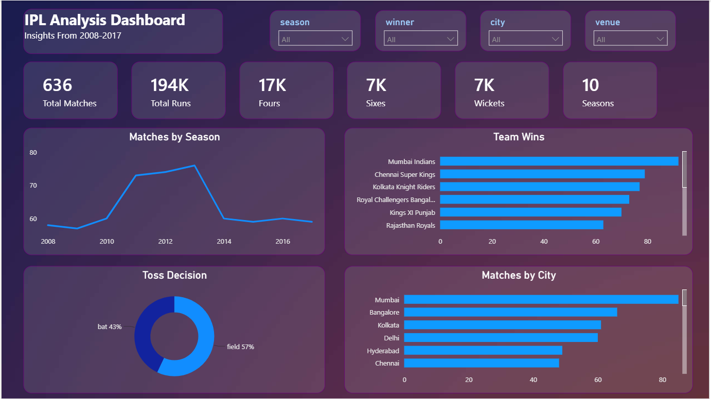
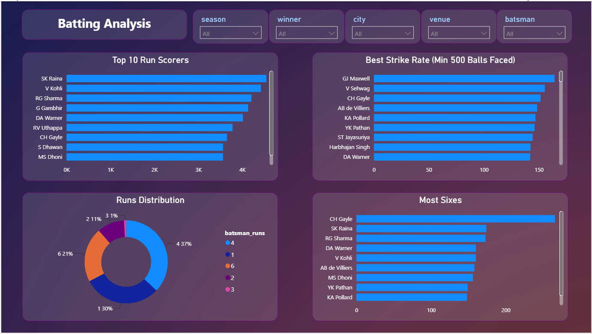
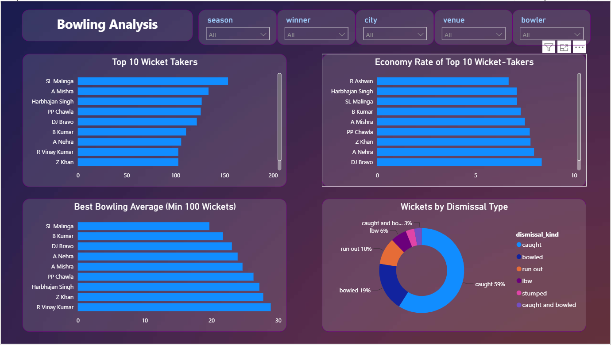
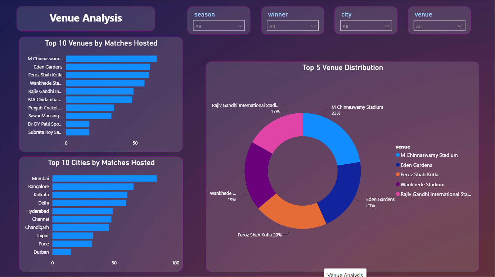
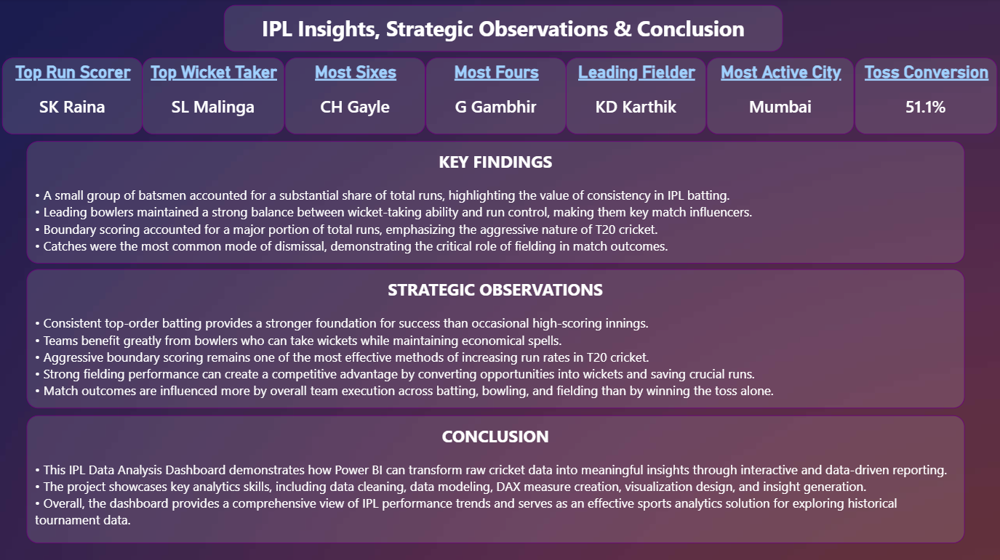

# 🏏 IPL Data Analysis Dashboard

## 📌 Project Overview

This project presents an interactive IPL Data Analysis Dashboard developed using Power BI. The dashboard analyzes historical IPL match and ball-by-ball data to uncover insights related to batting performance, bowling performance, fielding contributions, toss decisions, venue trends, and overall match statistics.

The objective of this project is to transform raw cricket data into meaningful visual insights that support data-driven decision-making and demonstrate practical data analysis skills.

---

## 📊 Dashboard Pages

* Overview
* Batting Analysis
* Bowling Analysis
* Fielding Analysis
* Toss Analysis
* Venue Analysis
* Insights & Summary

---

## 🛠️ Tools & Technologies Used

* Power BI
* Power Query
* DAX (Data Analysis Expressions)
* Data Modeling
* Data Visualization
* IPL Historical Match Dataset

---

## 🔍 Key Insights

* Identified top-performing batsmen based on runs scored and consistency.
* Analyzed leading wicket-takers and bowling effectiveness.
* Evaluated fielding contributions through catches and dismissals.
* Examined the impact of toss decisions on match outcomes.
* Compared venue-wise performance and scoring trends.
* Summarized strategic findings through an insights page.

---

## 📷 Dashboard Screenshots

### Overview

### Batting Analysis

### Bowling Analysis

### Venue Analysis

### Insights & Summary

---

## 📂 Project Files

* IPL_Dashboard.pbix – Power BI dashboard file
* README.md – Project documentation
* screenshots/ – Dashboard screenshots

---

## 🚀 How to Open the Project

1. Download or clone this repository.
2. Open `IPL_Dashboard.pbix` using Microsoft Power BI Desktop.
3. Explore the dashboard pages and interact with the visualizations.

---

## 📈 Skills Demonstrated

* Data Cleaning
* Data Transformation
* Data Modeling
* DAX Calculations
* Dashboard Design
* Data Visualization
* Business Insight Generation

---

### Data Source

IPL Historical Match and Ball-by-Ball Dataset
